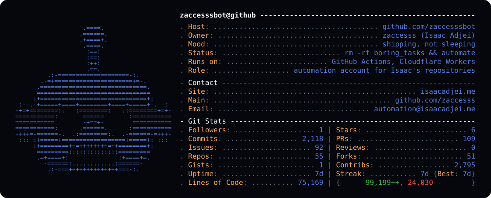

  <a href="https://github.com/zaccesss">Main account</a>
  &nbsp;&bull;&nbsp;
  <a href="https://isaacadjei.me">Site</a>
  &nbsp;&bull;&nbsp;
  <a href="https://github.com/zaccesssbot/.github">About this account</a>

<picture>
  <source media="(prefers-color-scheme: dark)" srcset="profile/profile-dark.svg">
  <source media="(prefers-color-scheme: light)" srcset="profile/profile-light.svg">
  
</picture>

**Something looks wrong?** Reach out at [automation@isaacadjei.me](mailto:automation@isaacadjei.me).
